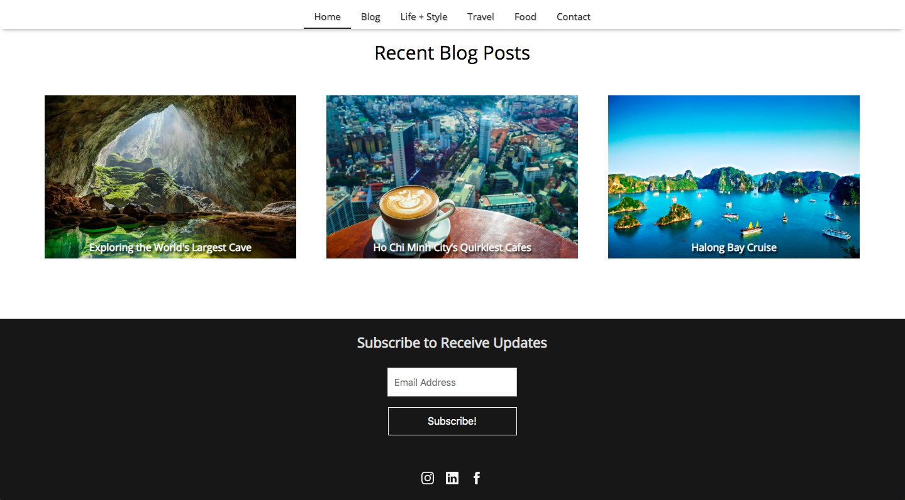
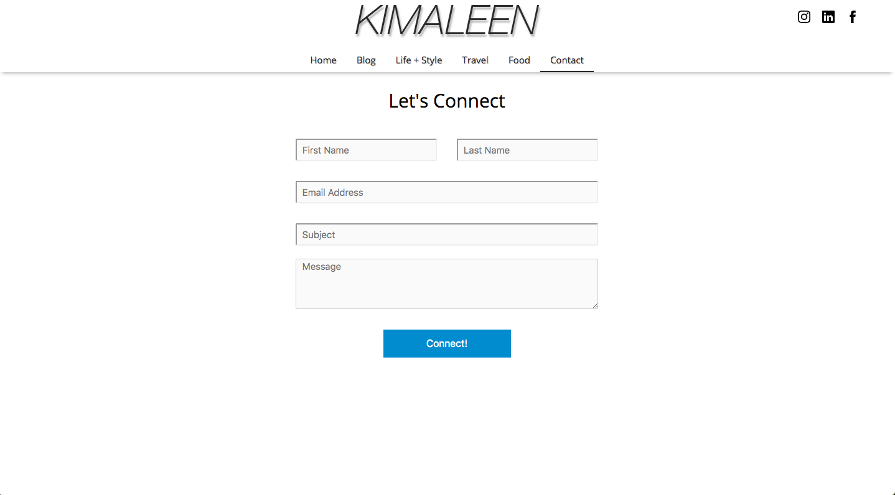

# HerBlog

HerBlog is a web application that utilizes data fetched from a GraphQL endpoint to display blog posts filtered by travel, food and lifestyle. This application also allows visitors to the site to send emails to contact the blog owner directly with feedback and messages. This app is built with React.js, React Static, GraphQL, GraphCMS and Express.js.

## NOTE: Currently adding finishing touches to application (work in progress) before deploying to production.

## Starting the Application Locally:

1. Clone down this repository.

2. `cd` into the `HerBlog` directory.

3. Run `npm install`.

4. Run `npm start`.

# Landing Page

# Bottom of Landing Page/Footer

# Blog Posts Page

# Contact Page

